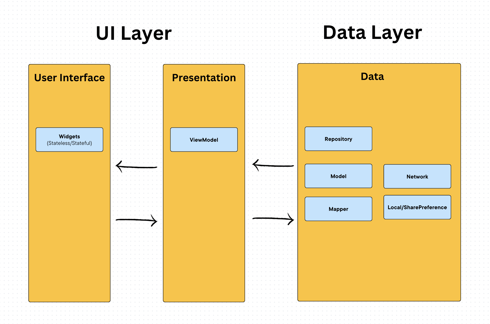

# Weather forecast 24h challenge

#### 🏛️ Architecture
MVVM architecture

The overall architecture is composed of two layers; UI Layer and the data layer. Each layer has dedicated components and they each have different responsibilities. The arrow means the flow of the communication & component has a dependency on the target component following its direction.
This means that the User interface can only communicate to the ViewModel and doesn't have direct access to the data layer.

#### Setup
1. Clone repository
2. run `make pub_get`
3. run `make force_build`
3. start the app by running `make run`

